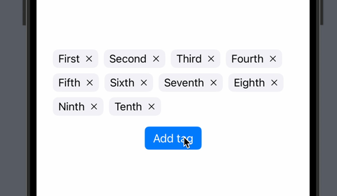

# Cashmere

Because it's cozy here.


## TagView for SwiftUI and UIKit

**TagView** is a lightweight and customizable view for creating tag-like layouts in SwiftUI, powered by the maturity and flexibility of UIKit. It provides smooth animations, excellent performance, and compatibility with **iOS 13+**, making it a reliable choice for projects targeting a wide range of iOS versions.





### Features

- **Customizable**: Easily define your tag appearance and behavior with a simple closure.
- **High Performance**: Uses UIKit under the hood, avoiding SwiftUI's limitations with GeometryReader and HStacks.
- **Backward Compatible**: Supports iOS 13 and newer, leveraging UIKit's mature APIs.
- **Ease of Use**: Minimal setup and integration into SwiftUI projects.


### Installation

#### Swift Package Manager (Recommended)

1. Open your project in Xcode.
2. Go to **File > Add Packages**.
3. Enter the repository URL:  
```plaintext
   https://github.com/EvgenijLutz/Cashmere.git
```
4. Select the latest version and add it to your project.

### Usage

#### Basic Example

```Swift
import SwiftUI
import Cashmere


struct SomeItem: Identifiable {
    let id = UUID()
    let name: String
}


final class TestViewModel: ObservableObject {
    @Published var items: [SomeItem] = [
        .init(name: "First"),
        .init(name: "Second"),
        .init(name: "Third"),
        .init(name: "Fourth"),
        .init(name: "Fifth"),
    ]
    
    func removeItem(with id: SomeItem.ID) {
        items.removeAll { $0.id == id }
    }
}


struct TestTagView: View {
    var title: String
    var removeAction: () -> Void
    
    var body: some View {
        HStack {
            Text(title)
                .font(.callout)
            
            Button {
                // Remove item with animation
                withAnimation {
                    removeAction()
                }
            } label: {
                Image(systemName: "xmark")
                    .font(.caption2)
            }
        }
        .tint(Color(UIColor.label))
        .padding(.horizontal, 8)
        .padding(.vertical, 4)
        .background(Color(UIColor.secondarySystemBackground))
        .clipShape(RoundedRectangle(cornerRadius: 8))
    }
}


struct TagTestView: View {
    @ObservedObject var viewModel: ViewModel
    
    var body: some View {
        // Feed the TagView with identifiable items
        TagView(viewModel.items) { item in
            // Place your tag layout here
            TestTagView(title: item.name) {
                viewModel.removeItem(with: item.id)
            }
        }
    }
}
```

### How It Works

The TagView relies on a custom UIView implemented in UIKit, wrapped in SwiftUI using UIViewRepresentable. This allows for fine-grained control over layout and animation behavior while still offering a SwiftUI-friendly API.


### License

This project is licensed under the MIT License. See the [LICENSE](LICENSE) file for details.


### Contributing

Contributions, issues, and feature requests are welcome! Feel free to open a PR or submit issues via the GitHub repository.


### Author

[Evgenij Lutz](https://github.com/EvgenijLutz)
